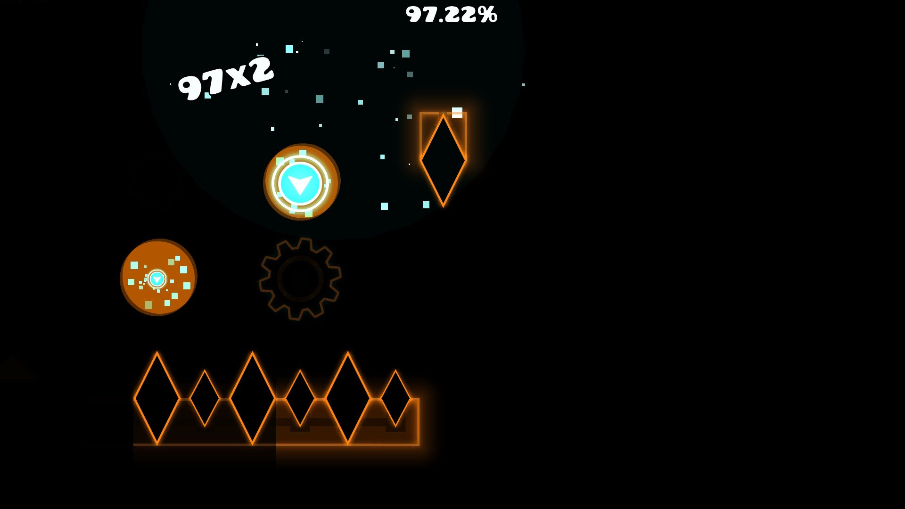

# Death Counter Popup

A simple mod to add a text popup when you die, showing how many times you got that run (including runs from 0 and to 100).

This mod saves death counter per level, and will use data from Death Tracker if it's installed.
One advantage of using alongside Death Tracker is the mod's level linking feature, which will be prioritized when loading deaths.
This mod will NOT link levels, and the popup will be per level (daily/weekly, gauntlet, editor/copy, saved online levels are separated).

Relations:

<mod:elohmrow.death_tracker>  
<mod:cvolton.level-id-api>

Example:

