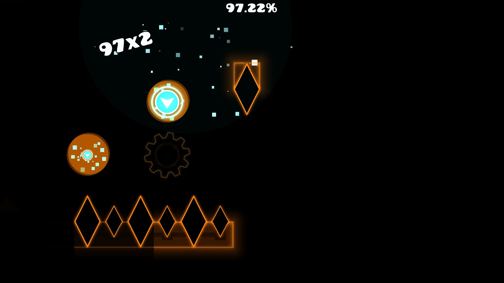

# Death Counter Popup

_- More like Run Counter Popup, but I can't change the name now -_

A simple mod to add a text popup when you die, showing how many times you got that run (including runs from 0 and to 100).  
The percentage can be inaccurate if the level has different end points (like end trigger).

This mod saves run counter per level, and will use data from Death Tracker if it's enabled.
One advantage of using alongside Death Tracker is the mod's level linking feature, which will be prioritized when loading deaths.

This mod will NOT link levels (_for now, I'll implement that when I finished learning how to compose custom UI, probably by 1.2.0_), and the popup will be per level (daily/weekly, gauntlet, editor/copy, saved online levels are separated).

Relations:

[elohmrow.death_tracker](https://github.com/abb2k/death-tracker)  
[cvolton.level-id-api](https://github.com/Cvolton/level-id-api-geode)

Example:

